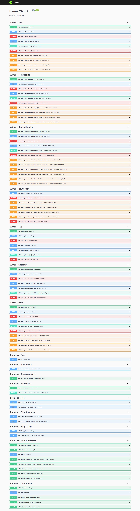

# NestJs CMS Api

A simple yet to grow cms that has been developed using nestjs.
it uses mongodb as database along with secure user authentication in frontend.
for authentication it uses jwt auth.
below are the features:

- swagger
- mongodb
- mongoose
- blog (post, category, tag)
- contact inquiry
- newsletters
- faqs
- testimonials etc.

below are the screenshots of the app



to run the application follow below process.

## Configuration

copy ".env.example" file and rename it as ".env" and add firebase configuration to integrate firebase

## Installation

```sh
npm install
npm run start:dev
```